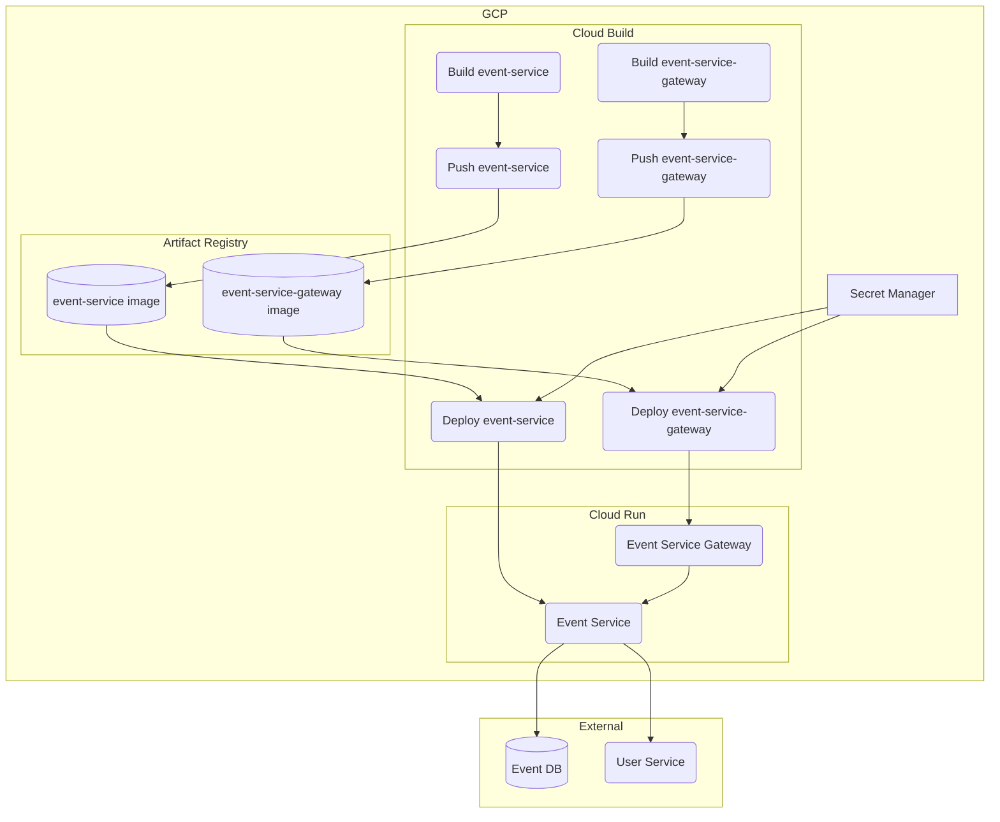

# Event Service

- Microservices Architecture
- gRPC
- gRPC Gateway
- Buf ([buf.build/qkitzero/event-service](https://buf.build/qkitzero/event-service))
- Clean Architecture
- Docker
- Test
- Codecov
- Cloud Build
- Cloud Run

